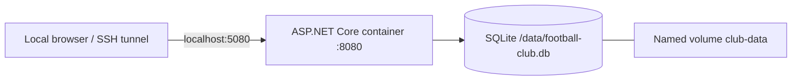

**Author:** Daan Eggen
**Date:** 26/09/2026
**Version:** 2.0

# Infrastructure design: self-hosted prototype

The delivered deployment uses one ASP.NET Core container and an embedded SQLite file on a persistent volume. This replaces the earlier proposed PostgreSQL container architecture to match the actual code.

The container runs as the `app` user. Only localhost is bound on the host. Docker Compose supplies the volume and restart policy. Schema initialization runs during application startup. Database files are excluded from the image build context.

The [deployment implementation](../deployment-implementation.md) links the actual configuration and describes build, startup, persistence, backup and rollback. The [test report](../test-report.md) distinguishes completed verification from checks that still need a Docker host.

HTTPS termination, public hosting, automatic health checks, scheduled encrypted backups and deployment automation remain future design work. No production availability or security validation is claimed for this unauthenticated school prototype.
