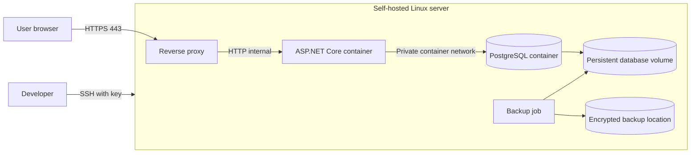

**Author:** Daan Eggen  
**Date:** 18/07/2026  
**Version:** 1.0

---

# Infrastructure Design: Self-Hosted Deployment

## 1. Purpose

This document designs a small self-hosted environment for the football club application. It focuses on a setup that a software developer can build, deploy and maintain without requiring enterprise infrastructure.

## 2. Infrastructure Requirements

| Type        | Requirement                                                            |
| ----------- | ---------------------------------------------------------------------- |
| Functional  | Users can reach the application securely through a web browser.        |
| Technical   | The C# application and database run as separate containers.            |
| Technical   | The database is not directly accessible from the internet.             |
| Technical   | Deployment is reproducible and persistent data is backed up.           |
| Technical   | Secrets are stored outside source control.                             |
| Operational | Application health and failed backups can be checked by the developer. |

## 3. Deployment Design

Only HTTPS and restricted SSH are exposed. Docker Compose defines the reverse proxy, application, database, volumes, private network and health checks in one version-controlled configuration.

## 4. Components

| Component              | Responsibility                                                                   |
| ---------------------- | -------------------------------------------------------------------------------- |
| Linux host             | Runs containers, firewall, updates and scheduled backups.                        |
| Reverse proxy          | Terminates HTTPS and forwards requests to the application.                       |
| ASP.NET Core container | Runs the football club web application.                                          |
| PostgreSQL container   | Stores application data on a persistent volume.                                  |
| Backup job             | Creates regular database dumps and copies them to a separate encrypted location. |

## 5. Deployment Flow

1. Automated tests run before a release is created.
2. A versioned application image is built.
3. The developer connects using SSH and pulls the approved version.
4. Docker Compose recreates only changed containers.
5. Health checks verify the application and database connection.
6. The previous image remains available for rollback.

Database migrations are versioned SQL scripts. They are backed up and tested before being applied because no ORM migration system is used.

## 6. Security and Reliability

- Allow inbound traffic only on HTTPS and SSH; restrict SSH by firewall where practical.
- Use SSH keys, disable password login and avoid running the application as root.
- Store production secrets in server-side environment or secret files excluded from Git.
- Keep the database on an internal container network and use a least-privilege database account.
- Install host and container security updates regularly.
- Create daily database backups, retain multiple versions and test restoration.
- Record application logs with rotation so they cannot fill the disk.

## 7. Validation

| Design aspect    | Validation method                                               | Acceptance criterion                                            |
| ---------------- | --------------------------------------------------------------- | --------------------------------------------------------------- |
| Reproducibility  | Deploy on a clean test server from the documented configuration | The complete stack starts without manual container changes.     |
| Network security | Port scan and firewall review                                   | Only the intended HTTPS and SSH ports are externally reachable. |
| Persistence      | Restart and recreate containers                                 | Members, payments and schedules remain available.               |
| Backup           | Restore a backup into a clean database                          | The restored application contains the expected records.         |
| Availability     | Stop the application or database container                      | Health checks report the failure and recovery is documented.    |
| Release safety   | Deploy and roll back one version                                | Both deployment and rollback complete without losing data.      |

## 8. Design Decision

One Linux server with Docker Compose is selected for the prototype. It is understandable for a software developer, inexpensive, and provides practical experience with containers, networking, HTTPS, persistence and backups. It does not provide high availability, so a larger production rollout would require separate hosts, managed backups and more extensive monitoring.
