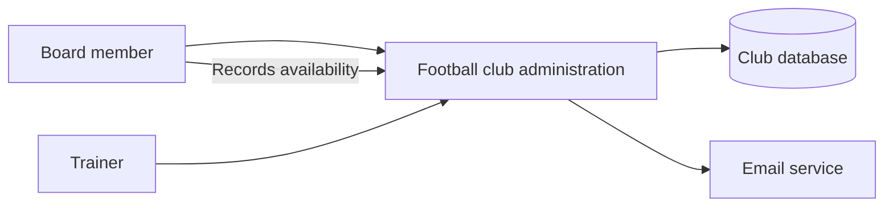
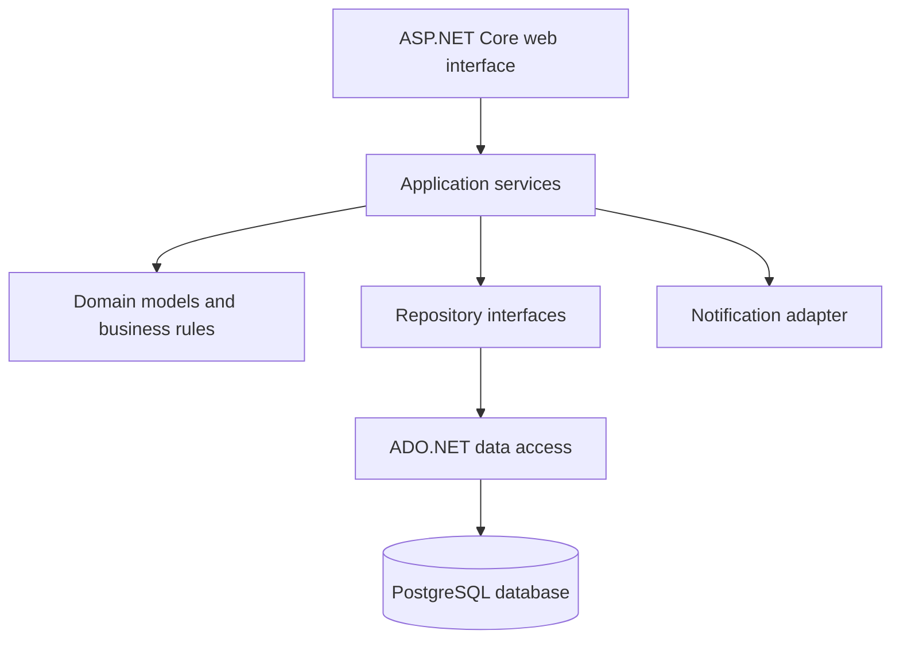
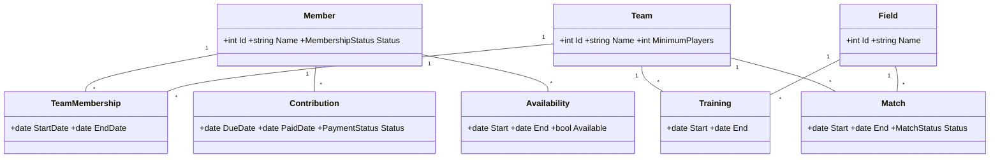

**Author:** Daan Eggen  
**Date:** 18/07/2026  
**Version:** 1.0

---

# Software Design: Football Club Administration

## 1. Purpose

This document designs the C# web application for managing members, contributions, teams, training sessions and matches. It communicates the main design choices and defines how they will be validated against functional, technical and aesthetic requirements.

## 2. Design Requirements

| Type | Requirement |
| --- | --- |
| Functional | Administrators can manage members, teams, contributions, fields, training sessions and matches. |
| Functional | The system identifies overdue contributions and creates reminders. |
| Functional | The system automatically proposes matches using player and field availability. |
| Functional | The prototype can generate dummy members, teams and matches. |
| Technical | The application is written in C# and stores data without an ORM. |
| Technical | Business rules are separated from the user interface and database code. |
| Aesthetic | The interface is clear for non-technical board members and trainers. |
| Aesthetic | Statuses, conflicts and required actions are easy to scan. |

## 3. System Context

Board members maintain administration, payments and availability. Trainers manage team and planning information. The application stores club data and sends contribution reminders through an email service.

## 4. Application Structure

The application uses a layered architecture so each responsibility can be developed and tested separately.

| Layer | Responsibility |
| --- | --- |
| Web interface | Pages, input validation and role-based views. |
| Application services | Coordinates use cases such as registering a payment or planning a match. |
| Domain | Contains entities and rules for payments, availability and conflicts. |
| Data access | Executes parameterized SQL through ADO.NET; no ORM is used. |
| Notification adapter | Sends reminders without coupling the domain to one email provider. |

## 5. Core Domain Model

The database model will refine keys and relations. The domain model communicates the concepts and rules used by the code.

## 6. Important Design Flows

### Match Planning

1. A trainer selects a team and planning period.
2. The application finds times with enough available players and a free field.
3. It excludes overlapping matches and training sessions.
4. It presents a proposal for confirmation before saving it.
5. If no valid option exists, the interface shows the limiting conflicts.

### Contribution Reminder

1. The application finds unpaid contributions past their due date.
2. It prevents duplicate reminders for the same reminder period.
3. It sends the message and records the result.

## 7. Interface Principles

- Use consistent navigation for Members, Teams, Planning and Contributions.
- Present searchable tables for administration tasks.
- Use text and color together for paid, overdue, available and conflicting statuses.
- Keep forms short, show validation next to the relevant field and request confirmation for destructive actions.
- Support desktop and mobile widths and meet WCAG 2.2 AA contrast and keyboard-use expectations.

## 8. Validation

| Design aspect | Validation method | Acceptance criterion |
| --- | --- | --- |
| User workflows | Prototype walkthrough with a board-member or trainer role | A user can complete the main tasks without explanation. |
| Business rules | Unit tests | Overdue payments and availability-aware planning produce the expected result. |
| Data access | Integration tests with a test database | CRUD operations work and all SQL uses parameters. |
| Prototype scope | Acceptance test using generated dummy data | Dummy records are created and a valid match proposal can update the database. |
| Architecture | Code review against the layer diagram | UI and SQL code do not contain domain rules. |
| Interface | Responsive, keyboard and contrast checks | Main tasks work at mobile and desktop widths and meet WCAG 2.2 AA checks. |

## 9. Design Decision

The layered ASP.NET Core design is selected because it fits the required C# prototype, supports direct SQL without an ORM, and keeps planning and payment rules independently testable. The diagrams, requirement table and validation criteria make the design discussable before and during implementation.
