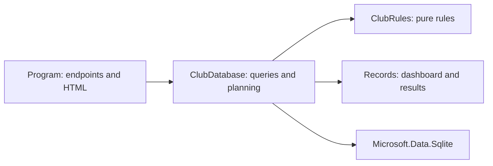

**Author:** Daan Eggen
**Date:** 26/09/2026
**Version:** 2.0

# Software Design: Football Club Administration

## Scope and implementation

This document describes the implemented C# prototype. Browser routes and HTML rendering live in `Program.cs`; `ClubDatabase` executes direct SQLite SQL and coordinates planning. `ClubRules` contains pure rules that can be tested without a database. There is no ORM, repository interface, email adapter or authentication layer. Those were intentions in the original design, not delivered components.

## C4 level 1: context

The prototype records reminders internally; it does not connect to an external email service. Both user groups currently use the same dashboard.

## C4 level 2: containers

SQLite is an embedded data store, not a separate database server. The application renders HTML on the server and exposes JSON at `/api/status`.

## C4 level 3: components

## C4 level 4: UML code/class diagram

This diagram zooms into the application container and names the actual C# types and public operations. Async operations return `Task` or `Task<T>`. `Program` is the application entry point, and `ClubRules` is a static class.

The records are read models, not active database entities. `TeamId` and `MemberId` express database relationships; the records do not hold navigation objects. Fields, availability, trainings and reminders are SQL tables without separate C# entity classes. See [models](../../src/server/Models/ClubModels.cs), [rules](../../src/server/Models/ClubRules.cs) and [database code](../../src/server/Data/ClubDatabase.cs). This distinction makes the level-4 diagram different from the conceptual ERD.

## Behavior and trade-offs

Planning checks the next fourteen dates at 18:30 for a 90-minute match. It requires enough available members and rejects overlapping matches or training sessions for either the field or the selected team. It immediately saves the first valid slot. Reminder creation selects overdue unpaid contributions and uses a unique contribution/date constraint to prevent daily duplicates. Payment recording leaves an existing paid date intact.

The compact repository is practical for this prototype but combines SQL and orchestration. Pure rules have been extracted for unit testing. Concurrent scheduling is not transactionally protected against two simultaneous reservations; authentication, real email, CRUD screens for all entities and time-slot availability remain outside the implemented scope. See the [test plan](../test-plan.md) and [test report](../test-report.md) for verification and limitations.
