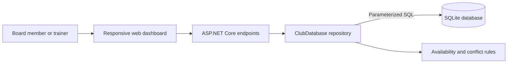

**Author:** Daan Eggen  
**Date:** 16/08/2026  
**Version:** 1.0

---

# Implementation: Football Club Administration

## Project Summary

I developed a working web prototype for managing a local football club. The application gives board members and trainers one responsive dashboard for viewing members, assigning players to teams, registering contribution payments, generating payment reminders, and automatically scheduling matches.

The server is written in C# with ASP.NET Core and stores its data in SQLite. All database operations use direct, parameterized SQL through ADO.NET (`Microsoft.Data.Sqlite`); no ORM such as Entity Framework is used.

## Delivered Functionality

| Assignment requirement | Implementation |
| --- | --- |
| Generate dummy data | On first start, the application creates two teams, two fields, sixteen members, contributions, and fourteen days of availability. |
| Plan matches automatically | The planner searches the next fourteen days and reserves the first time with enough available team members and a free field. |
| Prevent planning conflicts | Existing matches and training sessions are checked for overlapping start and end times. |
| Update payments | An unpaid contribution can be marked as paid from the dashboard. |
| Update memberships | Members can be assigned to a team, moved between teams, or made unassigned. |
| Send overdue reminders | The prototype creates a recorded reminder for each overdue contribution and prevents duplicates on the same day. |
| Simple user interface | A responsive dashboard presents statistics, actions, matches, contributions, and memberships. |

## Technical Implementation



The HTTP endpoints in `Program.cs` handle browser requests and form submissions. `ClubDatabase` contains persistence and planning operations, while record types in `Models` describe the data returned to the interface. Database creation is reproducible through `Data/schema.sql`. The database uses foreign keys and constraints to preserve relationships between members, teams, contributions, availability, fields, training sessions, matches, and reminders.

The match planner checks each evening in chronological order. For every candidate time it:

1. Finds a field without an overlapping match or training session.
2. Counts available members assigned to the selected team.
3. Compares that count with the team's minimum-player requirement.
4. Saves and returns the first valid match, or explains why no slot was found.

## Interface and API

The main dashboard is available at `/`. A JSON representation of the complete club status is exposed at `/api/status`. Form endpoints register payments, update memberships, generate reminders, and plan matches. Every route is represented in `src/server/FootballClub.Server.http`, allowing the behavior to be tested from an editor with HTTP-client support.

The interface uses semantic tables, labelled form fields, high-contrast status indicators, responsive layouts, and text alongside color so important information remains understandable on desktop and mobile screens.

## Verification and Result

The complete solution compiled successfully with **zero warnings and zero errors**. Startup also created the SQLite schema and dummy records successfully. An HTTP request collection has been supplied for repeatable endpoint testing; its state-changing requests can be run individually and verified afterwards through `GET /api/status`.

The resulting prototype meets the core assignment requirements and demonstrates C# web development, relational database design, direct SQL data access, business-rule implementation, and responsive interface design. For a production release, authentication, role-based authorization, a real email provider, audit logging, and automated unit and integration tests should be added.

## Running the Prototype

From the repository root:

```bash
dotnet restore src/FootballClub.slnx
dotnet run --project src/server/FootballClub.Server.csproj --no-launch-profile --urls http://localhost:5080
```

Open `http://localhost:5080` in a browser. The SQLite database and initial demonstration data are created automatically on first start.
