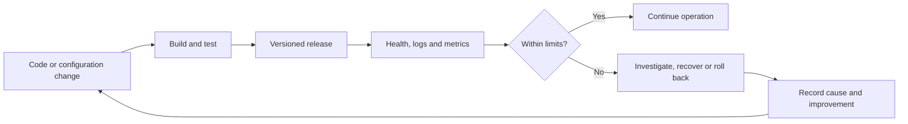

**Author:** Daan Eggen  
**Date:** 16/08/2026  
**Version:** 1.0

---

# Operations Plan: Control and Monitoring

## 1. Purpose

This document defines how the football club application can be controlled and monitored during development, commissioning and use. The goal is to detect failures early, release changes safely and keep member, payment and planning data available and correct.

This supports the learning outcome **Control, Monitoring and Optimization** by translating technical risks into checks, limits, responsibilities and recovery actions.

## 2. Scope and Current Situation

The current prototype is an ASP.NET Core application using direct parameterized SQL and a local SQLite database. It exposes a dashboard and an `/api/status` endpoint. The self-hosted design describes a later Docker Compose environment with a reverse proxy, application container and PostgreSQL database.

The controls are therefore divided into two levels:

- Development controls that can already be applied to the SQLite prototype.
- Operational controls required when the application is commissioned on the self-hosted server.

## 3. Control Cycle

Every change passes through the same cycle. Monitoring is used as feedback for the next development decision instead of only being checked after a failure.

## 4. Development Controls

| Control | Method | Acceptance criterion | Action on failure |
| --- | --- | --- | --- |
| Compilable release | Run `dotnet build` before a release | 0 errors and 0 warnings | Do not release; correct the reported issue. |
| Database consistency | Enable foreign keys and use schema constraints | Invalid relations and duplicate reminder dates are rejected | Correct the SQL or data before continuing. |
| SQL safety | Review commands for parameters | User-provided values are never concatenated into SQL | Replace unsafe SQL with parameters. |
| Functional behavior | Test payments, memberships, reminders and planning | Each operation changes only the intended records | Fix and repeat the scenario. |
| Source control | Commit a reviewed, identifiable version | Deployed version can be linked to a Git commit | Stop deployment until the version is known. |

On 16/08/2026, `dotnet build FootballClub.slnx --no-restore` completed successfully with **0 warnings and 0 errors**. This confirms that the current source compiles, but does not replace functional and integration tests.

## 5. Commissioning Controls

| Check | Acceptance criterion | Evidence |
| --- | --- | --- |
| Configuration | Production secrets are outside Git and development settings are disabled | Configuration review |
| Network exposure | Only HTTPS and restricted SSH are externally reachable | Port scan and firewall rules |
| Database access | Database accepts connections only from the application network | Container and network inspection |
| Persistence | Data remains after application and container restart | Restart test |
| Backup | A database backup can be restored on a clean environment | Restore report |
| Health | Application and database failures are detected | Health-check and alert test |
| Rollback | Previous application version starts without data loss | Rollback test |

Commissioning is complete only when every check has evidence. A successful page load alone is not enough because it does not prove backup recovery, restricted access or rollback.

## 6. Monitoring Plan

| Signal | Target or threshold | Frequency | Response |
| --- | --- | --- | --- |
| HTTP health | Successful response | Every minute | Check application and database logs; restart or roll back if required. |
| Request failures | Less than 1% server errors in 15 minutes | Continuous | Inspect the affected route and recent release. |
| Response time | 95% of dashboard requests below 500 ms | Continuous | Inspect slow SQL and server resources. |
| Disk usage | Below 80% | Every 5 minutes | Rotate logs, inspect growth and extend storage if justified. |
| Backup result | One successful daily backup | Daily | Repair the job and create a verified backup immediately. |
| Restore test | Successful restoration | Monthly | Treat the backup process as unreliable until corrected. |
| Certificate expiry | More than 14 days remaining | Daily | Renew and verify HTTPS. |
| Overdue reminder job | Completes once per scheduled run | Daily | Inspect errors and rerun without creating duplicates. |

Logs should record timestamp, severity, route or operation, duration and a correlation identifier. Member names, email addresses, payment details, passwords and secrets should not be written to operational logs.

## 7. Incident Response

1. Confirm the alert and determine whether users or data are affected.
2. Preserve relevant logs and note the deployed version and start time.
3. Limit impact by disabling the failing operation, restarting a component or rolling back.
4. Restore data only from a verified backup and record which backup was used.
5. Verify the main workflows after recovery.
6. Document the cause, impact, resolution and a preventive improvement.

For this small project, the developer is responsible for response and recovery. In real club use, a board contact should also be assigned to communicate interruptions and verify administrative data after restoration.

## 8. Validation

| Scenario | Expected result |
| --- | --- |
| Stop the web application | Health monitoring reports failure within two minutes. |
| Make the database unavailable | The application reports an unhealthy state without exposing connection details. |
| Fill a test disk past the threshold | A warning is generated before writes fail. |
| Restore the latest backup | Members, contributions and schedules match the backup point. |
| Deploy a faulty version | The previous version can be restored without losing database data. |

## 9. Conclusion

The application will be controlled through build checks, safe release criteria, health monitoring, backups and tested recovery. The current build result provides initial development evidence. Before real use, automated health checks, structured logs, alerts and restore tests must be implemented and verified in the self-hosted environment.
