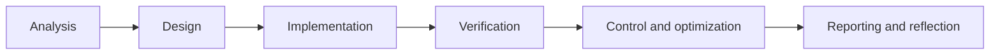

**Author:** Daan Eggen\
**Date:** 20/09/2026\
**Version:** 1.1

---

# Professional Practice: Project Organisation and Communication

## 1. Purpose

This document explains how I organized the football club administration project and how communication with stakeholders is planned and documented. It supports the learning outcome **Professional Standard** by showing traceable decisions, structured work and communication adapted to the people involved.

## 2. Project Context

The assignment is an individual project for a local football club. The goal is to analyze, design and build a C# web prototype for member administration, contribution tracking and match planning.

The main stakeholders are:

| Stakeholder | Interest | Information needed | Suitable communication |
| --- | --- | --- | --- |
| Board member | Reliable administration and contribution overview | Progress, risks, functionality and data reliability | Short demonstration and non-technical summary |
| Trainer | Team information and conflict-free planning | Planning workflow, availability and limitations | Scenario-based prototype walkthrough |
| Members | Correct personal, team and payment information | What data is stored and how it is used | Clear privacy and process explanation |
| Teacher / assessor | Evidence of the development process and learning outcomes | Research, decisions, implementation and reflection | Portfolio documents and repository link |
| Developer | Maintainable and verifiable solution | Requirements, design choices, tasks and technical risks | Git history, code and technical documentation |

## 3. Project Organisation

I divided the assignment into phases that follow the required development process:

| Phase | Main result | Completion criterion |
| --- | --- | --- |
| Analysis | Project and deployment analyses | Problem, users, information and deployment choice are explained. |
| Design | Software and infrastructure designs | Architecture, data responsibilities and validation criteria are defined. |
| Implementation | Working ASP.NET Core prototype | Required workflows operate using direct SQL without an ORM. |
| Verification | Build and endpoint evidence | Solution builds without errors and behavior can be checked repeatedly. |
| Operations | Monitoring and optimization documents | Risks, thresholds, query findings and improvements are documented. |
| Portfolio | Learning-outcome evidence | Documents are understandable without requiring the source code. |

The work is stored in Git. Separate commits for the initial analysis, designs and implementation make the development process traceable. Each document includes an author, date and version so a reviewer can identify its status.

## 4. Planning and Progress Control

I use the assignment deliverables as a backlog. A task is complete when its result exists, matches the challenge requirements and has been checked against an explicit criterion.

| Priority | Work item | Status | Evidence |
| --- | --- | --- | --- |
| High | Analyze users, processes and required information | Complete | Project analysis |
| High | Design software and deployment environment | Complete | Software and infrastructure designs |
| High | Build required C# web prototype | Complete | Source code and implementation report |
| High | Verify compilation and main endpoints | Complete | Successful build and HTTP request collection |
| Medium | Define operational control and monitoring | Complete | Operations plan |
| Medium | Investigate database optimization | Complete | Query-plan analysis |
| Medium | Add automated unit and integration tests | Planned improvement | Identified in the implementation report |
| Medium | Add authentication and authorization | Outside prototype scope | Identified production requirement |

Risks are handled by making their impact and response explicit:

| Risk | Impact | Control |
| --- | --- | --- |
| Requirements are interpreted incorrectly | Prototype does not solve the club's problem | Link every implemented feature to an assignment requirement. |
| Scope becomes too large | Required prototype is not completed | Prioritize the required workflows and record production features separately. |
| A code change breaks existing behavior | Incorrect administrative data | Build, repeat endpoint scenarios and inspect database results. |
| Documentation differs from implementation | Misleading portfolio evidence | Review documents against current code and label future designs clearly. |
| Personal data appears in test evidence | Privacy risk | Use generated names and `example.test` email addresses. |

## 5. Stakeholder Communication

Communication should answer the stakeholder's question instead of presenting unnecessary technical detail. For example, a trainer needs to see that the planner checks players and fields; the SQL implementation is mainly relevant to a technical reviewer.

A structured review would use the following agenda:

1. Explain the problem and goal in one minute.
2. Demonstrate member assignment, contribution handling and match planning.
3. Ask whether the workflow and terminology match club practice.
4. Record requested changes, their priority and the person who requested them.
5. Confirm which feedback will be implemented within the prototype scope.

### Feedback Record Template

| Date | Stakeholder | Observation or request | Priority | Decision | Follow-up |
| --- | --- | --- | --- | --- | --- |
| To be completed | To be completed | To be completed | To be agreed | To be recorded | To be assigned |

The supplied LO6/LO7 assessment feedback has been addressed through the [completed repair record](../personal-leadership/personal-leadership-reflection.md#acting-on-feedback-completed-repairs) and the revised [research question and method mapping](exploratory-research-and-reporting.md). These are document repairs; assessor confirmation of their adequacy is still pending.

No completed stakeholder session is claimed in this document. The template makes future feedback traceable and prevents assumptions from being presented as validated user needs.

## 6. Individual and Team Practice

Although this challenge is completed individually, I apply working practices that also support a team:

- Git commits separate meaningful project phases.
- Requirements and decisions are written down instead of remaining personal knowledge.
- Architecture diagrams give developers a shared view of responsibilities.
- Acceptance criteria make review less dependent on personal interpretation.
- Parameterized SQL, consistent naming and separated files make changes easier to review.
- Open improvements are reported rather than hidden.

In a team, work items would additionally have an owner, reviewers would approve changes through merge requests, and decisions or feedback would be linked to the relevant issue.

## 7. Reflection

The phased approach kept the implementation connected to the original challenge. The repository and documents show how the project moved from analysis to design, implementation and operational evaluation.

The main limitation is that stakeholder needs are currently based on the supplied case rather than recorded interviews or usability sessions. A next professional step is to demonstrate the prototype to a board-member or trainer role, record their feedback and use it to reprioritize the backlog.

## 8. Conclusion

The project is organized through phased deliverables, explicit completion criteria, Git version control and documented risks. Stakeholder communication is prepared around demonstrations, understandable language and traceable feedback. This creates a professional process that works for an individual project and can be extended to team collaboration.
